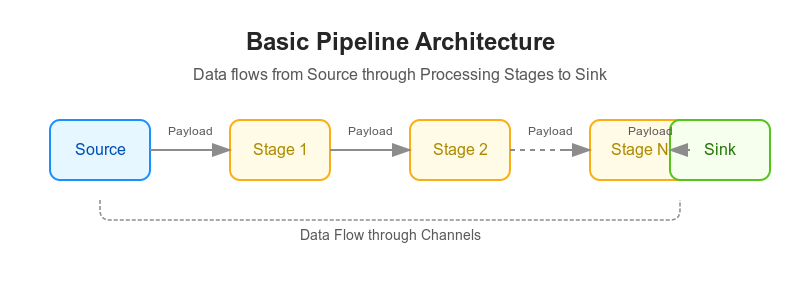
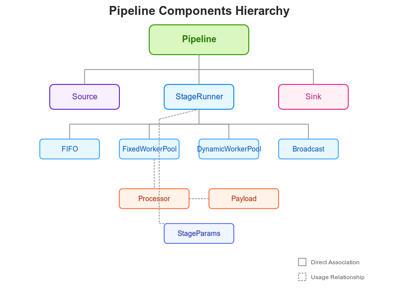
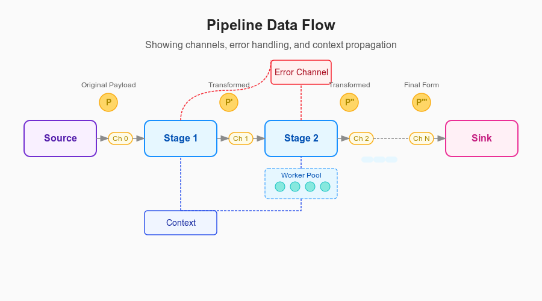
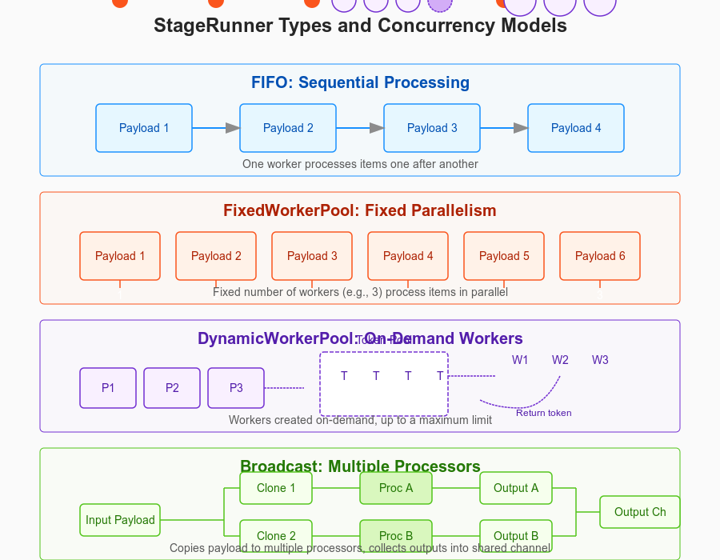
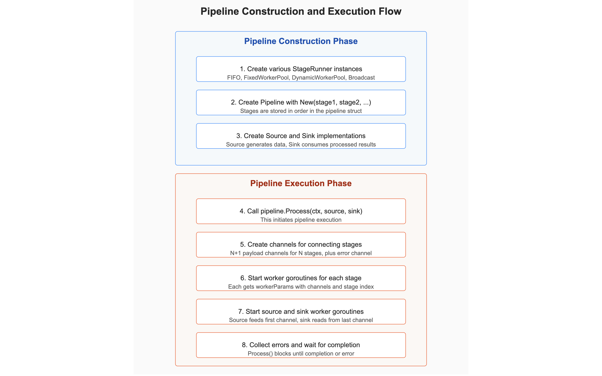
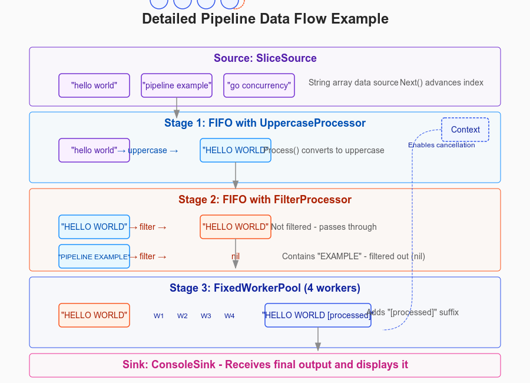
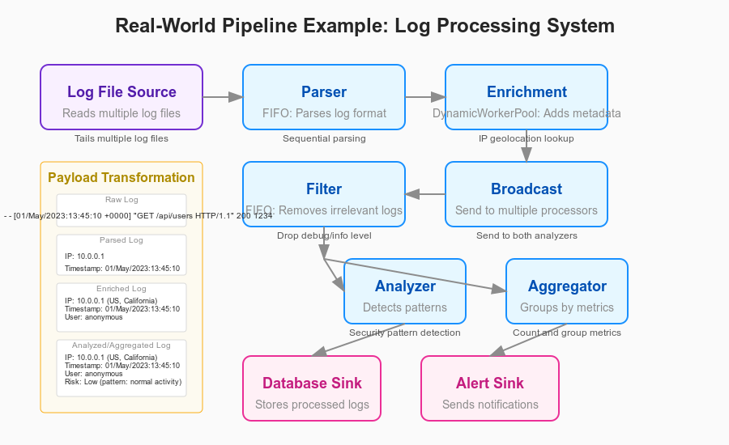

# Understanding Software Pipelines: A Comprehensive Guide

## What is a Pipeline?

At its essence, a pipeline is an architectural pattern where data flows through a series of processing stages. Each stage performs a specific operation on the data before passing it to the next stage. This allows for modular, maintainable, and potentially concurrent processing.

Think of a pipeline like an assembly line in a factory. Raw materials (input data) enter at one end, undergo various transformations as they move through different workstations (processing stages), and emerge as finished products (processed output) at the other end.



## Key Components of Your Pipeline Package



### 1. Core Interfaces

Let's first understand the fundamental building blocks:

**Payload** - The data flowing through your pipeline

- Like materials moving along a conveyor belt in a factory
- Must be able to create copies of itself (Clone)
- Keeps track of when it's done being processed (MarkAsProcessed)

**Processor** - The logic that transforms Payloads

- Like workers at each station in our factory assembly line
- Takes a Payload, processes it, and produces a new or modified Payload
- Can decide to stop a Payload's journey (by returning nil)

**StageRunner** - The machinery that drives each processing stage

- Like the actual workstation in our factory analogy
- Manages the flow of Payloads through a stage
- Reads inputs, processes them, writes outputs
- Handles errors and context cancellation

**Source** - Where the data originates

- Like the raw materials entrance to our factory
- Generates Payloads to feed into the pipeline
- Reports errors when they occur during retrieval

**Sink** - The final destination for processed data

- Like the shipping department of our factory
- Consumes the fully processed Payloads
- May perform final operations like storage or transmission

**StageParams** - The internal plumbing connecting pipeline stages

- Like the conveyor system between workstations
- Provides input and output channels for Payloads
- Provides an error reporting channel
- Tracks the position of the stage in the pipeline

### 2. How It All Fits Together: The Pipeline Flow



### 3. How Data Actually Flows Through the Pipeline

Let me walk through how data actually flows through this pipeline:

1. **Initialization**: When you create a pipeline, you specify a series of StageRunners that define how Payloads will be processed.

2. **Source Generation**: The Source creates Payloads and sends them to the first stage. Think of this as the "raw materials" entering the factory.

3. **Channel Creation**: The Pipeline.Process method creates a series of Go channels to connect the stages. Each stage receives from one channel and sends to the next.

4. **Worker Creation**: For each stage, the pipeline creates one or more goroutines to process the data. These workers are managed according to the type of StageRunner:
   - With FIFO, one worker processes items in sequence
   - With FixedWorkerPool, a fixed number of workers process items in parallel
   - With DynamicWorkerPool, workers are created as needed up to a maximum
   - With Broadcast, the same Payload is sent to multiple processors

5. **Data Flow**: The Payloads flow through these channels from one stage to the next. At each stage:
   - A Payload is received from the input channel
   - The stage's Processor transforms it into a new Payload
   - The new Payload is sent to the output channel for the next stage
   - If a Processor returns nil, the Payload journey ends at that stage

6. **Error Handling**: If any stage encounters an error while processing a Payload, it:
   - Reports the error to the error channel
   - May terminate its processing

7. **Sink Consumption**: The final stage sends its output to the Sink, which:
   - Consumes the fully processed Payloads
   - Marks them as processed

8. **Pipeline Termination**: The pipeline ends when:
   - The Source has no more Payloads
   - The context is canceled
   - An unrecoverable error occurs

### 4. Concrete Examples of Pipeline Components

Let's look at some concrete examples of how these interfaces might be implemented:

```go
// Example implementation of a Payload
type TextPayload struct {
    Text      string
    processed bool
}

// Clone creates a deep copy of the payload
func (p *TextPayload) Clone() Payload {
    return &TextPayload{
        Text:      p.Text,
        processed: p.processed,
    }
}

// MarkAsProcessed marks this payload as processed
func (p *TextPayload) MarkAsProcessed() {
    p.processed = true
}

// Example implementation of a Processor
type UppercaseProcessor struct{}

// Process converts text to uppercase
func (p *UppercaseProcessor) Process(ctx context.Context, payload Payload) (Payload, error) {
    // Type assertion to access the concrete payload type
    textPayload, ok := payload.(*TextPayload)
    if !ok {
        return nil, fmt.Errorf("expected TextPayload, got %T", payload)
    }
    
    // Create a new payload with transformed data
    return &TextPayload{
        Text: strings.ToUpper(textPayload.Text),
    }, nil
}

// Example implementation of a Source
type SliceSource struct {
    texts  []string
    index  int
    lastErr error
}

func NewSliceSource(texts []string) *SliceSource {
    return &SliceSource{
        texts: texts,
        index: -1,
    }
}

// Next advances to the next item
func (s *SliceSource) Next(ctx context.Context) bool {
    select {
    case <-ctx.Done():
        s.lastErr = ctx.Err()
        return false
    default:
        s.index++
        return s.index < len(s.texts)
    }
}

// Payload returns the current payload
func (s *SliceSource) Payload() Payload {
    if s.index < 0 || s.index >= len(s.texts) {
        return nil
    }
    return &TextPayload{
        Text: s.texts[s.index],
    }
}

// Error returns any error encountered
func (s *SliceSource) Error() error {
    return s.lastErr
}

// Example implementation of a Sink
type ConsoleSink struct {
    results []string
}

func NewConsoleSink() *ConsoleSink {
    return &ConsoleSink{
        results: make([]string, 0),
    }
}

// Consume processes the final payload
func (s *ConsoleSink) Consume(ctx context.Context, p Payload) error {
    textPayload, ok := p.(*TextPayload)
    if !ok {
        return fmt.Errorf("expected TextPayload, got %T", p)
    }
    
    // Store the result
    s.results = append(s.results, textPayload.Text)
    fmt.Println("Result:", textPayload.Text)
    return nil
}

// Example of how to use these components in a pipeline
func ExamplePipeline() {
    // Create source with some text data
    source := NewSliceSource([]string{
        "hello world",
        "pipeline example",
        "go concurrency",
    })
    
    // Create processors
    uppercaseProc := &UppercaseProcessor{}
    
    // Create a filter processor using ProcessorFunc
    filterProc := ProcessorFunc(func(ctx context.Context, p Payload) (Payload, error) {
        textPayload, _ := p.(*TextPayload)
        
        // Filter out payloads containing "EXAMPLE"
        if strings.Contains(textPayload.Text, "EXAMPLE") {
            // Returning nil stops this payload from continuing through the pipeline
            return nil, nil
        }
        return p, nil
    })
    
    // Create sink to collect results
    sink := NewConsoleSink()
    
    // Create the pipeline with different stage types
    pipeline := New(
        FIFO(uppercaseProc),              // Simple sequential stage
        FIFO(filterProc),                 // Another sequential stage with filtering
        FixedWorkerPool(                  // Parallel processing stage
            ProcessorFunc(func(ctx context.Context, p Payload) (Payload, error) {
                textPayload, _ := p.(*TextPayload)
                return &TextPayload{
                    Text: textPayload.Text + " [processed]",
                }, nil
            }), 
            4, // Number of workers
        ),
    )
    
    // Execute the pipeline
    ctx := context.Background()
    if err := pipeline.Process(ctx, source, sink); err != nil {
        fmt.Printf("Pipeline error: %v\n", err)
        return
    }
    
    fmt.Println("Pipeline completed successfully!")
    fmt.Println("Results:", sink.results)
}
```

## 5. Types of StageRunners

The pipeline package provides several different StageRunner implementations, each with different concurrency models. Let's visualize how they differ:



## 6. Understanding the Four Types of StageRunners

Let's dive deeper into each type of StageRunner in the pipeline package:

### FIFO (First-In, First-Out)

- **What it does**: Processes payloads sequentially, one after another
- **When to use it**: For operations that must happen in order or don't benefit from parallelism
- **How it works**: A single goroutine reads from the input channel, processes each payload, and writes to the output channel
- **Pros**: Simple, predictable, preserves ordering, low resource usage
- **Cons**: Limited throughput, blocking (slow operations block the entire pipeline)

### FixedWorkerPool

- **What it does**: Processes payloads in parallel using a fixed number of workers
- **When to use it**: For CPU-bound operations that benefit from parallelism but need resource constraints
- **How it works**: Spawns a fixed number of FIFO workers that all read from the same input channel
- **Pros**: Better throughput, predictable resource usage
- **Cons**: All workers must complete before the stage is considered done

### DynamicWorkerPool

- **What it does**: Creates workers on-demand, up to a maximum limit
- **When to use it**: For operations with variable processing times or I/O-bound operations
- **How it works**: Uses a token system to limit the maximum number of concurrent workers
- **Pros**: Adaptable to workload, more efficient for variable-time operations
- **Cons**: More complex, potential for resource contention

### Broadcast

- **What it does**: Sends copies of each payload to multiple processors
- **When to use it**: When you need to perform different operations on the same data
- **How it works**: Clones the payload and sends it to multiple FIFO stages, collects all outputs into one channel
- **Pros**: Enables parallel processing paths for the same data
- **Cons**: More complex, uses more memory due to payload cloning

## 7. Pipeline Construction and Execution Flow

Let's visualize the exact steps that happen when you build and run a pipeline:



## 8. Detailed Explanation of the Pipeline Data Flow

Let me walk through exactly how data flows through the pipeline, taking a concrete example:



## 9. Real-World Application of Pipeline Pattern

Let's take a practical example to illustrate where this pipeline architecture works well in real-world scenarios:



## 10. Key Benefits of the Pipeline Pattern

Now that we've explored the package in detail, let's understand why this architecture is valuable:

1. **Modularity**: Each component has a single responsibility, making the code easier to understand and maintain. You can replace or modify individual stages without affecting the rest of the pipeline.

2. **Concurrency Control**: The package provides different concurrency models (FIFO, FixedWorkerPool, DynamicWorkerPool) allowing fine-grained control over parallelism.

3. **Resource Management**: Worker pools help manage resource consumption by limiting the number of concurrent operations.

4. **Error Handling**: Centralized error collection and propagation makes it easier to handle failures within the pipeline.

5. **Separation of Concerns**: By separating the pipeline infrastructure from processing logic, developers can focus on implementing individual processors without worrying about the flow mechanics.

6. **Scalability**: The pipeline can be scaled horizontally by adding more worker pools, or vertically by adjusting worker counts.

7. **Testability**: Each component (Source, Processor, Sink) can be tested in isolation, making unit testing simpler.

## 11. Common Use Cases for Pipelines

This pipeline architecture is particularly well-suited for:

1. **ETL Processes** (Extract, Transform, Load): Processing data from one format/system to another
2. **Log Processing**: Parsing, filtering, and analyzing log files
3. **Image/Video Processing**: Applying multiple transformations to media files
4. **Network Packet Processing**: Filtering, inspecting, and routing network traffic
5. **Web Crawling**: Fetching, parsing, and storing web content
6. **Data Validation**: Multiple validation steps on input data
7. **Batch Processing**: Processing large datasets in chunks

## 12. Summary: Understanding Your Pipeline Package

Your pipeline package implements a flexible, modular pipeline architecture using Go's concurrency primitives. Data flows through a series of stages, with each stage potentially transforming the data or filtering it out. The package provides different stage runner implementations to handle various concurrency needs, and it takes care of channels, goroutines, and error handling.

The key interfaces (Payload, Processor, StageRunner, Source, Sink) define the contracts that your components need to implement, while the pipeline orchestrates the flow of data between them. Channels connect the stages, enabling concurrent processing while maintaining order when needed.

When deciding which StageRunner to use for a stage:

- Use FIFO for simple sequential processing
- Use FixedWorkerPool for CPU-bound parallel tasks
- Use DynamicWorkerPool for variable-time or I/O-bound tasks
- Use Broadcast when you need to process the same data in multiple ways

This architecture helps you build complex data processing applications that are both maintainable and efficient, leveraging Go's powerful concurrency features.
